# Truth Sheild a Fake News Detechtor

---

names of members
Gyanendra Prakash
student bennett university
enrollment : s24cseu0771
email : gyaanendrap@gmail.com
github: Gyaanendra

Goutam mittal
student bennett university
enrollment : s24cseu0785
email : goutammittal2005@gmail.com
Github : goutam922

---

datasets
https://github.com/several27/FakeNewsCorpus

---

tech and frameworks
pytorch
sklearn
huggginface
transformers
lime
shap
captum and ig for explainitybilty
matplotlib
pandas
etc libs

hardware used for all phaeses is Nvidia rtx a6000 48 gb

---

data cleaing and preprocessing

we are taking only the
fake satire and creadiable labeled for v1 phaseof model training

for v2 and v3
we trained on only on FAKe and creadiable news

then we clean and perprocessed

# this is for all phases

    text = re.sub(r"Certainly!.*?:\s*", '', text, flags=re.IGNORECASE | re.DOTALL)
    text = re.sub(r"Sure!.*?:\s*", '', text, flags=re.IGNORECASE | re.DOTALL)
    text = re.sub(r"Here'?s.*?:\s*", '', text, flags=re.IGNORECASE | re.DOTALL)
    text = re.sub(r"Below is.*?:\s*", '', text, flags=re.IGNORECASE | re.DOTALL)
    text = re.sub(r"This is.*?:\s*", '', text, flags=re.IGNORECASE | re.DOTALL)
    text = re.sub(r"The following.*?:\s*", '', text, flags=re.IGNORECASE | re.DOTALL)
    text = re.sub(r"I('ve| have) (rewritten|reimagined|revised|created).*?:\s*", '', text, flags=re.IGNORECASE | re.DOTALL)
    text = re.sub(r"(Rewritten|Reimagined|Revised) (version|article|text).*?:\s*", '', text, flags=re.IGNORECASE | re.DOTALL)

    # Remove URLs
    text = re.sub(r'http[s]?://\S+', '', text)
    text = re.sub(r'www\.\S+', '', text)

    # Remove Source / Read More patterns
    text = re.sub(r'Source\s*:\s*\S*', '', text, flags=re.IGNORECASE)
    text = re.sub(r'\[Read More\.?\.*\]', '', text, flags=re.IGNORECASE)
    text = re.sub(r'Read More\.?\.?\.?', '', text, flags=re.IGNORECASE)

    # Remove % of readers / junk phrases
    text = re.sub(r'\d+%\s*of readers.*?\.', '', text, flags=re.IGNORECASE)
    text = re.sub(r'Add your two cents\.?', '', text, flags=re.IGNORECASE)
    text = re.sub(r'\(Before It\'s News\)', '', text, flags=re.IGNORECASE)

    # Remove special/junk characters
    text = re.sub(r'[^\x00-\x7F]+', ' ', text)
    text = re.sub(r'[%@#^*~`|\\<>{}]', ' ', text)

    # Remove extra whitespace
    text = re.sub(r'\n{2,}', '\n', text)
    text = re.sub(r'[ \t]+', ' ', text)
    text = text.strip()

    # ══════════════════════════════════════════
    # SECTION 1 — ENCODING & UNICODE FIXES
    # (word-safe: fixes invisible/malformed chars)
    # ══════════════════════════════════════════

    # 1a. Strip BOM and zero-width characters
    #     \ufeff = BOM, \u200b = zero-width space,
    #     \u200c = zero-width non-joiner, \u200d = zero-width joiner
    #     \u00ad = soft hyphen  — all invisible, cause silent bugs
    t = re.sub(r'[\ufeff\u200b\u200c\u200d\u00ad]', '', t)

    # 1b. Unicode NFC normalisation
    #     Makes accented chars consistent: e + combining accent → é (one char)
    t = unicodedata.normalize('NFC', t)

    # 1c. Decode HTML entities
    #     &amp; → &   &lt; → <   &gt; → >   &nbsp; → space   &quot; → "   &#39; → '
    html_entities = {
        '&amp;':  '&',
        '&lt;':   '<',
        '&gt;':   '>',
        '&nbsp;': ' ',
        '&quot;': '"',
        '&#39;':  "'",
        '&apos;': "'",
        '&mdash;': '-',
        '&ndash;': '-',
        '&hellip;': '...',
        '&ldquo;': '"',
        '&rdquo;': '"',
        '&lsquo;': "'",
        '&rsquo;': "'",
    }
    for entity, replacement in html_entities.items():
        t = t.replace(entity, replacement)
    # Catch any remaining numeric HTML entities e.g. &#160;
    t = re.sub(r'&#(\d+);', lambda m: chr(int(m.group(1))), t)
    t = re.sub(r'&#x([0-9a-fA-F]+);', lambda m: chr(int(m.group(1), 16)), t)

    # 1d. Smart quotes → straight quotes
    #     " " → "   ' ' → '
    t = t.replace('\u201c', '"').replace('\u201d', '"')   # " "
    t = t.replace('\u2018', "'").replace('\u2019', "'")   # ' '
    t = t.replace('\u00ab', '"').replace('\u00bb', '"')   # « »
    t = t.replace('\u2032', "'").replace('\u2033', '"')   # ′ ″

    # 1e. Normalise dashes
    #     em dash — and en dash – → plain hyphen -
    t = t.replace('\u2014', '-').replace('\u2013', '-')

    # ══════════════════════════════════════════
    # SECTION 2 — WHITESPACE & LINE ENDINGS
    # (word-safe: structural spacing only)
    # ══════════════════════════════════════════

    # 2a. Normalise line endings → \n only
    #     \r\n (Windows) and \r (old Mac) → \n
    t = t.replace('\r\n', '\n').replace('\r', '\n')

    # 2b. Tab → single space
    t = t.replace('\t', ' ')

    # 2c. Double (or more) space after sentence-ending punctuation → single space
    #     e.g. "Hello.  World" → "Hello. World"
    t = re.sub(r'([.!?])\s{2,}', r'\1 ', t)

    # ══════════════════════════════════════════
    # SECTION 3 — STRUCTURAL NOISE REMOVAL
    # (removes tags/markers/urls, not words)
    # ══════════════════════════════════════════

    # 3a. Remove [TAG] style markers
    t = re.sub(r'\[[^\]]{0,40}\]', '', t)

    # 3b. Remove (TAG) paren markers & empty parens
    t = re.sub(r'\([^)]{0,40}\)', '', t)

    # 3c. Remove bare URLs
    t = re.sub(r'https?://\S+', '', t)
    t = re.sub(r'www\.\S+', '', t)

    # 3d. Remove markdown links [text](url) → keep text only
    t = re.sub(r'\[([^\]]+)\]\(https?://\S+\)', r'\1', t)

    # 3e. Remove HTML tags
    t = re.sub(r'<[^>]+>', '', t)

    # 3f. Strip outer wrapping quotes (CSV artefact)
    #     e.g. the entire row text is wrapped in "..." or '...'
    t = t.strip()
    if (t.startswith('"') and t.endswith('"')) or \
       (t.startswith("'") and t.endswith("'")):
        t = t[1:-1].strip()

    # ══════════════════════════════════════════
    # SECTION 4 — SPECIAL CHARACTER REMOVAL
    # (removes non-alphanumeric noise)
    # ══════════════════════════════════════════

    # 4a. Remove all special/non-alphanumeric characters
    #     Keep: letters, digits, spaces, . , ! ? ' " - :
    t = re.sub(r"[^a-zA-Z0-9\s.,!?'\"'\-:]", ' ', t)

    # ══════════════════════════════════════════
    # SECTION 5 — PUNCTUATION NORMALISATION
    # (repeated punctuation → single character)
    # ══════════════════════════════════════════

    # 5a. Same char repeated with optional spaces between → single char
    t = re.sub(r'\.(\s*\.)+', '.', t)     # . . . → .
    t = re.sub(r',(\s*,)+',   ',', t)     # , , , → ,
    t = re.sub(r'-(\s*-)+',   '-', t)     # - - - → -
    t = re.sub(r':(\s*:)+',   ':', t)     # : : : → :
    t = re.sub(r'!(\s*!)+',   '!', t)     # ! ! ! → !
    t = re.sub(r'\?(\s*\?)+', '?', t)     # ? ? ? → ?

    # 5b. Mixed punctuation clusters → single period
    t = re.sub(r'[.,\-]{2,}', '.', t)

    # 5c. Final sweep: same char with spaces between
    t = re.sub(r'([.,\-:!?])(\s+\1)+', r'\1', t)

    # ══════════════════════════════════════════
    # SECTION 6 — CONTENT DEDUPLICATION
    # ══════════════════════════════════════════

    # 6a. Remove isolated single letters (except a, I)
    t = re.sub(r'(?<!\w)[b-hj-z](?!\w)', ' ', t, flags=re.IGNORECASE)

    # 6b. Remove lone 1-2 digit numbers
    t = re.sub(r'(?<!\w)\d{1,2}(?!\w)', ' ', t)

    # 6c. De-duplicate repeated headline at start of article
    half        = len(t) // 2
    first_half  = t[:half].strip()
    second_half = t[half:].strip()
    if first_half and len(first_half) > 40 and second_half.startswith(first_half[:60]):
        t = second_half

    # ══════════════════════════════════════════
    # SECTION 7 — BOILERPLATE REMOVAL
    # ══════════════════════════════════════════

    boilerplate = [
        r'\d*\s*of readers think this story is (Fact|Fiction)\.?',
        r'readers think this story is (Fact|Fiction)\.?',
        r'Filed under\s*:[^\n\.]*[\n\.]?',
        r'Updated\s+\d{1,2}:\d{2}\s*[ap]m[^\n]*',
        r'This article presents a remark\w*',
        r'Page \d+ of \d+',
        r'Click here to \w+[^\n\.]*',
        r'Subscribe to \w+[^\n\.]*',
        r'Read more\s*:?[^\n\.]*',
        r'Share this\s*:?[^\n\.]*',
    ]
    for pattern in boilerplate:
        t = re.sub(pattern, '', t, flags=re.IGNORECASE)

    # ══════════════════════════════════════════
    # SECTION 8 — FINAL WHITESPACE CLEANUP
    # ══════════════════════════════════════════

    t = re.sub(r'[ \t]{2,}', ' ', t)     # multiple spaces → one
    t = re.sub(r'\n{3,}', '\n\n', t)     # 3+ newlines → 2
    t = t.strip()

---

github- for all codes and everythings

https://github.com/Gyaanendra/AIML-PROJECT-CSET312

research paper we took for insiptation ideas

for adsent and tone oriented fake news classifer
https://arxiv.org/pdf/2601.15277

---

# Model V1 desing

we trained model on fakenews cropus dataset form github
directly on the data will hust cleaing and removin junk for articles

models failes on tone changed and ai generated news

Test results:
loss : 0.0202
accuracy : 0.9933
precision : 0.9928
recall : 0.9880
f1 : 0.9904
balanced_acc : 0.9921
mcc : 0.9853
roc_auc : 0.9997
pr_auc : 0.9995
runtime : 617.6955
samples_per_second : 947.9200
steps_per_second : 7.4070

# Model V2 desing

we fine tuning a roberta model on orginal + t5_parapharse_paws augmented data set for tone specdfiy things but still failes against ai gen fake news

https://huggingface.co/Vamsi/T5_Paraphrase_Paws

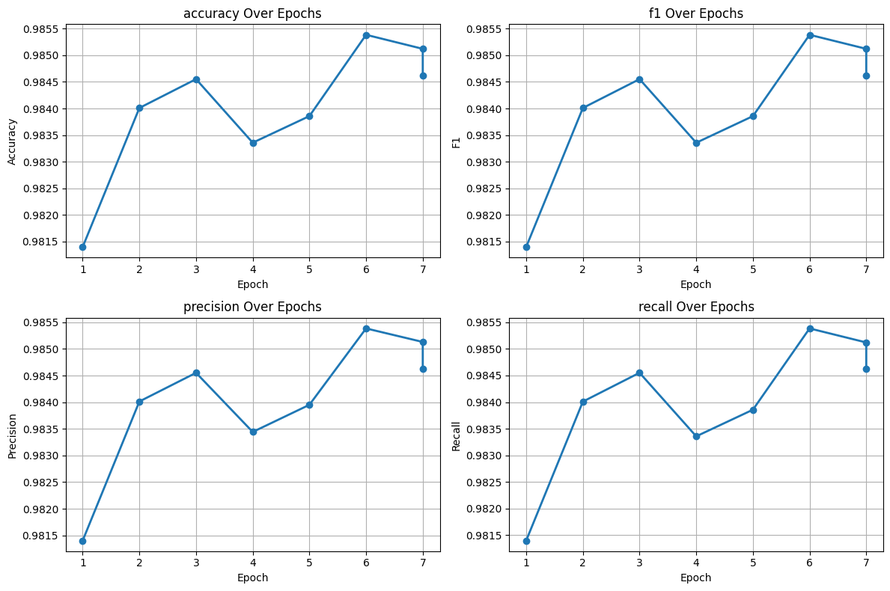

=== Overall Training Summary ===
Average Training Loss: 0.0258
Final Eval Accuracy: 0.9846
Final Eval F1 Score: 0.9846
Total Steps: 36500
Total Epochs: ~7.0
Best Accuracy at Epoch: 6

---

# Model V3 desing

model trainend on llm augemented using lfm-2-instrust model + originla data

we used ollama to get and use lfm-2-instrust model

https://huggingface.co/LiquidAI/LFM2.5-1.2B-Instruct

ollama run tomng/lfm2.5-instruct

## Figure 1

Dual-signal fake news classifier — complete system architecture

Now let's drill into each branch layer by layer.**Branch A detail:** Text is tokenized via BPE into up to 512 token IDs. These pass through RoBERTa's embedding layer then 12 stacked transformer blocks (self-attention + FFN + residuals). Only the `[CLS]` token's final 768-dim vector is extracted — it's the model's compressed "understanding" of the whole article. A custom classification head (Linear → Tanh → Dropout → Linear) converts this to 2 logits. The LLRD optimizer gives the top layers a higher learning rate than the bottom layers.

Finally, here's the training regime — how the two phases relate in time.Here's a complete written summary of everything shown across all five diagrams:

---

**Overall design philosophy**

The system bets that fake news can be caught from two complementary angles: _what the article means_ (deep language understanding from RoBERTa) and _how it's written_ (statistical quirks from GPT-2). Neither signal alone is as powerful as both combined.

**Fusion head**

The 768-dim and 3-dim vectors are concatenated into 771 values. A small fully-connected network (Linear(771→128) → ReLU → BatchNorm → Dropout(0.5) → Linear(128→2)) learns how to weight and combine both signals. The heavy dropout (50%) in this tiny head prevents it from ignoring the 3-dim signal and just memorizing from the 768-dim alone.

**Two-phase training**

Phase 1 trains RoBERTa end-to-end with early stopping (patience=3) and saves the best checkpoint by validation F1. Phase 2 then freezes RoBERTa entirely, pre-extracts all CLS embeddings as static tensors, computes all GPT-2 features, and trains only the small FusionHead. This split saves GPU memory and training time significantly — the heavy transformer is never touched in Phase 2.

## Figure 2

Branch A — RoBERTa architecture with full regularization annotation
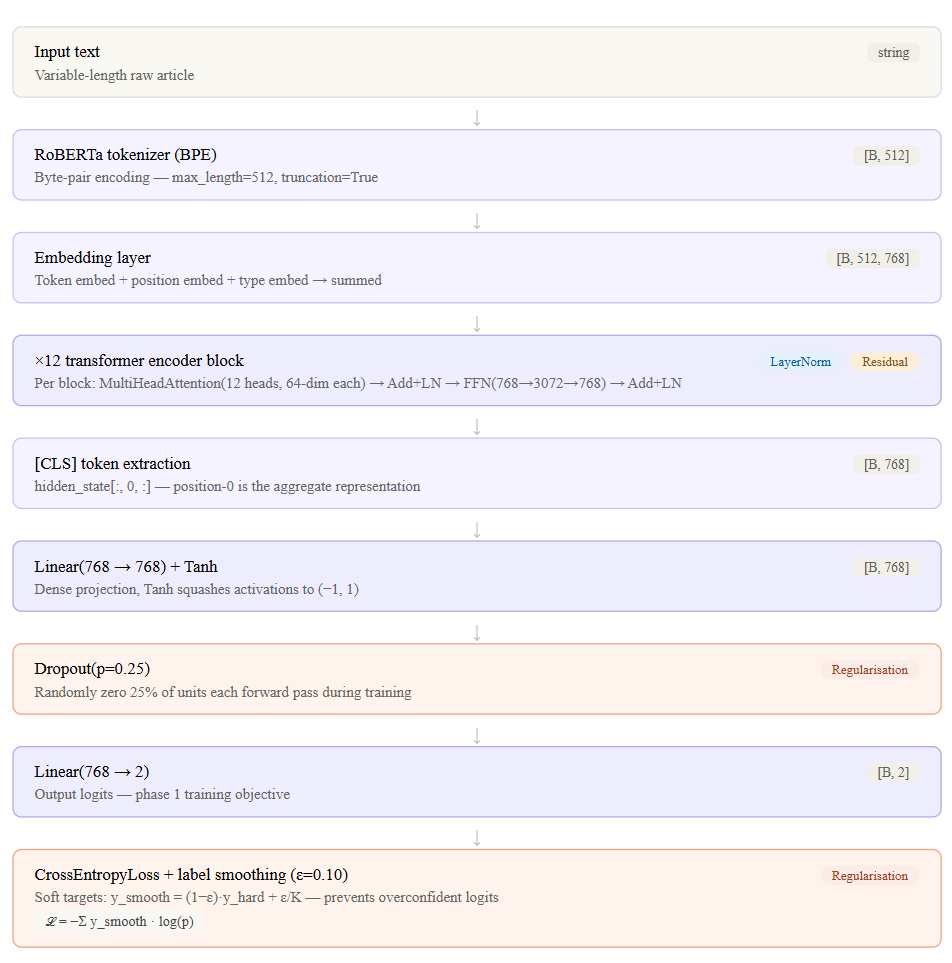

**Branch A — RoBERTa (semantic)**

RoBERTa-base is a 12-layer transformer pre-trained on 160 GB of text. The text is tokenized via byte-pair encoding into up to 512 integer IDs. Each token becomes a 768-dim vector in the embedding layer. The 12 transformer blocks then let every token attend to every other token, refining its meaning in context. By the final layer, the special `[CLS]` token at position 0 holds a compressed summary of the whole article — a 768-dim dense vector. A custom two-layer head (Linear → Tanh → Dropout(0.25) → Linear → 2 logits) is attached. All 12 encoder layers are fine-tuned using Layer-wise Learning Rate Decay — the top layers (closest to the head) learn at `1e-5`, while the bottom embedding layers learn at `1e-5 × 0.85¹³ ≈ 1e-6`, preventing catastrophic forgetting of pre-trained knowledge.

Regularization catalogue
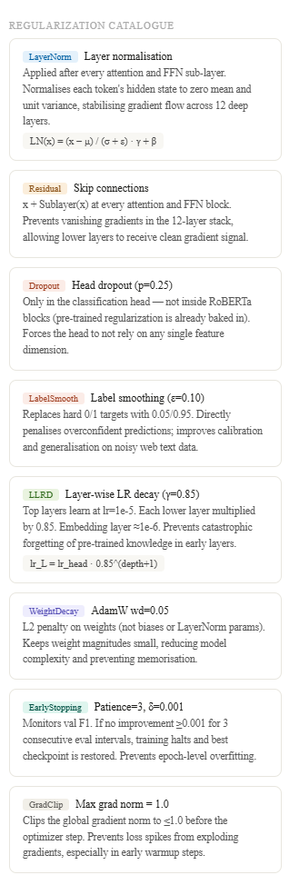

## Figure 3

Branch B (GPT-2 statistical features) + Fusion head — architecture and regularization

**Branch B — GPT-2 statistical features**

GPT-2 is used purely as a _measurement tool_, never fine-tuned. It asks: "how surprised is a standard language model by this text?" Real journalism tends to follow predictable patterns; poorly-written or AI-generated fake news often has unusual word combinations, giving higher GPT-2 perplexity. A second signal — sentence length variance via NLTK — captures stylistic regularity. The resulting 3-dim vector `[PPL, sentence_var, −PPL]` is z-score normalized to the training set's mean/std before being used.

**Statistical features explained**

0 PPL — perplexity loss
GPT-2 cross-entropy over the full article. Measures how "expected" the vocabulary choices are to a standard LM trained on real text.
1 SLV — sentence length variance
Variance of per-sentence word counts. Real journalism has varied sentence structure; generated/fake text tends toward uniform sentence lengths.
2 −PPL — inverse perplexity
Negation of feat[0]. Gives the network an explicit "low-perplexity = real" axis without requiring it to learn the negation from data. Provides a more symmetric feature space.

Why only 3 features?
The fusion head receives 768 semantic dims from Branch A. If stat features were ≫3 dims without strong signal, Branch A would numerically dominate and the statistical branch would be ignored. 3 carefully chosen scalar signals force the network to value each feature independently.

Branch B — statistical signals
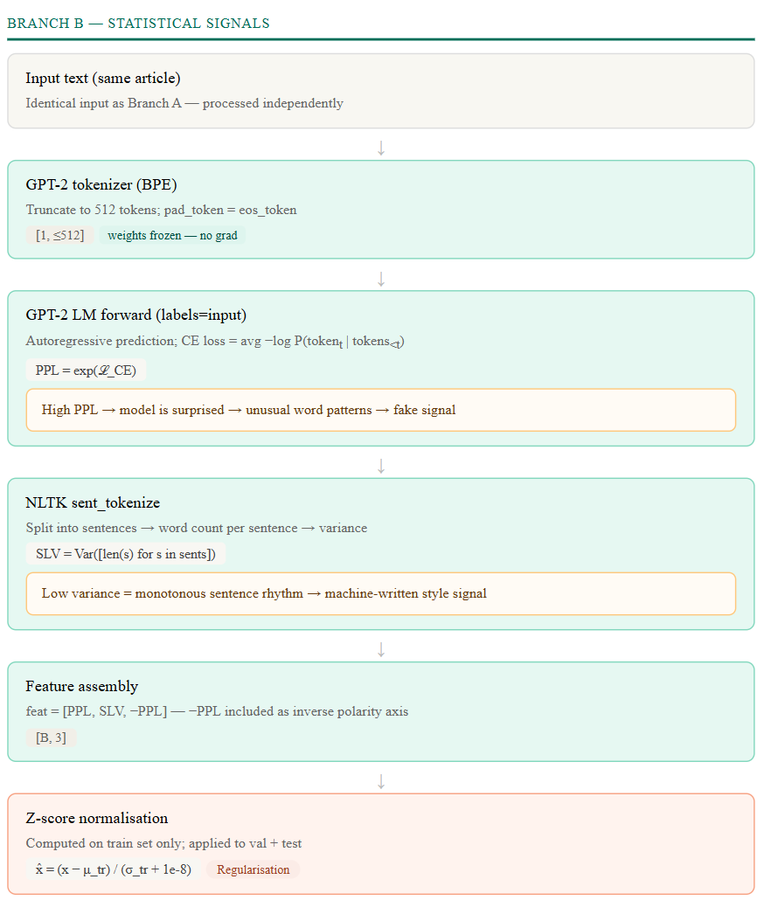

Fusion head — regularization stack
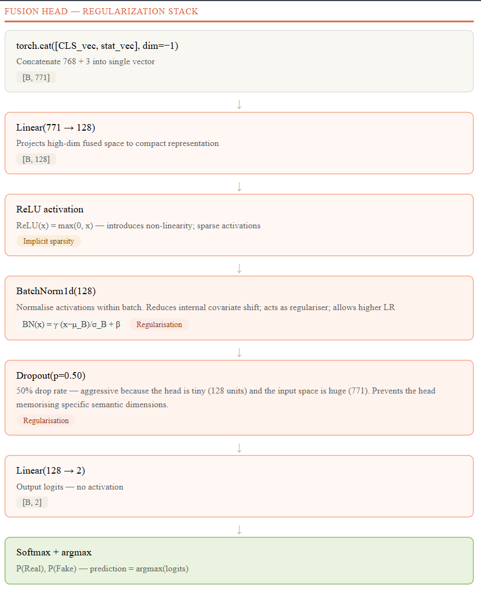

## Figure 4

Inference data flow (exact tensor shapes) and two-phase training configuration

Inference — article to prediction

Fusion head
The 768-dim and 3-dim vectors are concatenated into 771 values. A small fully-connected network (Linear(771→128) → ReLU → BatchNorm → Dropout(0.5) → Linear(128→2)) learns how to weight and combine both signals. The heavy dropout (50%) in this tiny head prevents it from ignoring the 3-dim signal and just memorizing from the 768-dim alone.

Two-phase training
Phase 1 trains RoBERTa end-to-end with early stopping (patience=3) and saves the best checkpoint by validation F1. Phase 2 then freezes RoBERTa entirely, pre-extracts all CLS embeddings as static tensors, computes all GPT-2 features, and trains only the small FusionHead. This split saves GPU memory and training time significantly — the heavy transformer is never touched in Phase 2.

Training configuration

Phase 1 — RoBERTa fine-tune
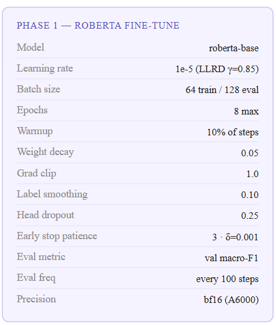

Phase 2 — Fusion head only
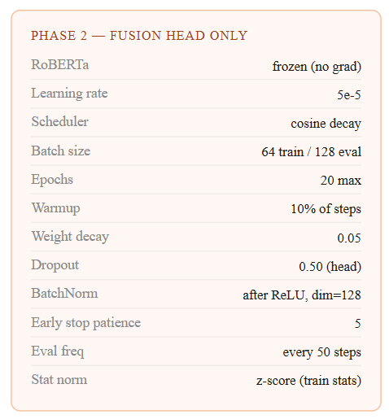

All anti-overfitting mechanisms
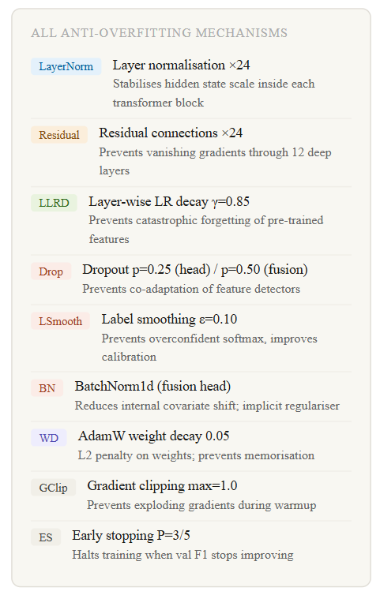

---

**LayerNorm + residual connections (×24 instances inside RoBERTa)**

These are the foundation of stability in a 12-layer transformer. Without residual connections (x + Sublayer(x)), gradients from the loss would vanish to near-zero before reaching the bottom layers — the network would only effectively train its top few blocks. LayerNorm normalizes each token's hidden vector to zero mean and unit variance after every sublayer, which prevents any single layer from producing activation values so large or small that the subsequent layers can't learn from them. Together they're what makes 12-layer (and 24-layer) transformers trainable at all.

**Layer-wise learning rate decay (LLRD, γ=0.85)**

RoBERTa was pre-trained on 160 GB of text — its lower layers already encode universal linguistic features (syntax, morphology, basic semantics). If you apply a uniform learning rate across all 12 layers, the optimizer will happily overwrite that knowledge to fit your specific dataset, a phenomenon called catastrophic forgetting. LLRD gives the top layers the full learning rate (1e-5) while multiplying each lower layer by 0.85, so the embedding layer learns at roughly 1e-6. The top layers adapt aggressively to "fake news detection"; the bottom layers preserve their pre-trained representations.

**Head dropout (p=0.25)**

Applied only in the classification head, not inside RoBERTa itself (the pre-trained model already incorporates dropout during its own pre-training). This forces the dense head to classify using multiple complementary feature dimensions rather than relying on a few strong ones. The 0.25 rate is conservative — enough to regularize a two-layer head without destroying signal from the 768-dim CLS embedding.

**Label smoothing (ε=0.10)**

This changes the training target from a hard one-hot vector [0, 1] to a soft vector [0.05, 0.95]. This prevents the model from pushing logits toward ±∞ to minimize loss — a regime where gradients vanish and the model becomes brittle on near-boundary examples. On web-scraped news text, which contains genuinely ambiguous articles, overconfident predictions are especially dangerous. Label smoothing improves calibration: the model's output probability better reflects actual uncertainty.

**High fusion-head dropout (p=0.50)**

The fusion head is tiny (128 hidden units) but receives 771-dimensional input. Without aggressive regularization, the head would learn to almost entirely ignore the 3-dim statistical branch (which contributes 3/771 ≈ 0.4% of input dimensions by count) and focus on the semantically dominant 768-dim CLS vector. The 50% dropout forces each forward pass to use a different random subset of hidden units, which prevents the network from encoding the full 768-dim → 2 mapping in a memorized way and forces it to use the statistical features meaningfully.

**BatchNorm1d**

Placed after ReLU in the fusion head. It normalizes the batch's activations at that layer to zero mean and unit variance (then allows the learned scale γ and shift β to re-adjust). This does two things: it reduces internal covariate shift (the statistical distribution of inputs to layer N changes every update because layer N-1's weights changed — BN removes this instability), and it acts as an implicit regularizer by introducing per-batch noise during training (each mini-batch has slightly different mean/std estimates). It also allows using a higher learning rate without divergence.

**AdamW weight decay (wd=0.05)**

Standard L2 regularization, but applied correctly via AdamW (which decouples weight decay from the adaptive gradient scaling, unlike vanilla Adam). This penalizes large weight magnitudes, keeping the model's effective capacity low and preventing memorization of training set artifacts. Crucially, bias terms and LayerNorm parameters are excluded from weight decay — applying L2 to biases is generally unhelpful and to LayerNorm parameters actively harmful.

**Gradient clipping (max_norm=1.0)**

During the warmup phase, learning rates are ramping up and gradients can be enormous, especially for the newly-initialized classification head. Clipping the global gradient norm to ≤1.0 prevents these spikes from causing large destructive weight updates that would take many subsequent steps to recover from. Once training stabilizes, this rarely activates.

**Early stopping (patience=3/5)**

The most direct defense against epoch-level overfitting. By monitoring validation macro-F1 and halting if it fails to improve by ≥0.001 for 3 consecutive eval intervals (Phase 1) or 5 epochs (Phase 2), training stops exactly when the model starts fitting training-set noise rather than generalizable patterns. The best checkpoint is restored, not the last one.

**Z-score normalization of statistical features**

Not technically a regularizer, but critical for the fusion head's ability to learn. If raw PPL values range ~3–8 and sentence variance ranges ~0–100, the linear layer's weights would need to be on very different scales to treat them comparably, and gradient updates would be wildly unequal. Z-scoring to zero mean and unit variance (using train-set statistics only — never leaking val/test distribution) puts all 3 features on the same footing and removes scale-dependent gradient imbalance.

After training

### Phase 1 Epoch Log

| Epoch | Global Step | Train Loss | Val Loss | Val Accuracy | Val F1 Macro | Val F1 Real | Val F1 Fake | Grad Norm | Timestamp |
| ----- | ----------- | ---------- | -------- | ------------ | ------------ | ----------- | ----------- | --------- | --------- | ------------------- |
| 0     | 1.0         | 2000       | 0.22970  | 0.23415      | 0.9806       | 0.9806      | 0.9808      | 0.9804    | 5.5918    | 2026-03-26 00:33:58 |
| 1     | 2.0         | 4000       | 0.21714  | 0.21684      | 0.9907       | 0.9907      | 0.9907      | 0.9907    | 4.6447    | 2026-03-26 00:57:09 |
| 2     | 3.0         | 6000       | 0.20626  | 0.21429      | 0.9919       | 0.9919      | 0.9919      | 0.9919    | 8.3801    | 2026-03-26 01:20:07 |
| 3     | 4.0         | 8000       | 0.20725  | 0.21221      | 0.9933       | 0.9933      | 0.9933      | 0.9933    | 0.1757    | 2026-03-26 01:43:11 |
| 4     | 5.0         | 10000      | 0.20859  | 0.21061      | 0.9940       | 0.9940      | 0.9940      | 0.9941    | 4.1195    | 2026-03-26 02:06:10 |
| 5     | 6.0         | 12000      | 0.20483  | 0.21113      | 0.9940       | 0.9940      | 0.9939      | 0.9940    | 0.5127    | 2026-03-26 02:29:08 |
| 6     | 7.0         | 14000      | 0.20517  | 0.21110      | 0.9940       | 0.9940      | 0.9940      | 0.9941    | 0.0711    | 2026-03-26 02:52:07 |

### Phase 2 Epoch Log

| Epoch | Global Step | Train Loss | Val Loss | Val Accuracy | Val F1 Macro | Val F1 Real | Val F1 Fake | Grad Norm | Timestamp |
| ----- | ----------- | ---------- | -------- | ------------ | ------------ | ----------- | ----------- | --------- | --------- | ------------------- |
| 0     | 1           | 2000       | 0.17770  | 0.03017      | 0.9942       | 0.9942      | 0.9941      | 0.9942    | 5.6827    | 2026-03-26 04:28:10 |
| 1     | 2           | 4000       | 0.00498  | 0.02465      | 0.9941       | 0.9941      | 0.9941      | 0.9941    | 0.1332    | 2026-03-26 04:28:50 |
| 2     | 3           | 6000       | 0.00454  | 0.02505      | 0.9939       | 0.9939      | 0.9939      | 0.9939    | 0.0914    | 2026-03-26 04:29:30 |
| 3     | 4           | 8000       | 0.00400  | 0.02498      | 0.9941       | 0.9941      | 0.9941      | 0.9942    | 0.0833    | 2026-03-26 04:30:10 |
| 4     | 5           | 10000      | 0.00381  | 0.02547      | 0.9940       | 0.9940      | 0.9940      | 0.9941    | 0.0777    | 2026-03-26 04:30:49 |
| 5     | 6           | 12000      | 0.00366  | 0.02598      | 0.9941       | 0.9941      | 0.9941      | 0.9942    | 0.0852    | 2026-03-26 04:31:28 |

### Test Results

| Phase          | Test Accuracy | Test F1 Macro | Test F1 Real | Test F1 Fake | Test Precision | Test Recall | Timestamp           |
| -------------- | ------------- | ------------- | ------------ | ------------ | -------------- | ----------- | ------------------- |
| phase1_roberta | 0.9942        | 0.9942        | 0.9941       | 0.9942       | 0.9942         | 0.9942      | 2026-03-26 02:53:29 |
| phase2_fusion  | 0.9942        | 0.9942        | 0.9942       | 0.9943       | 0.9942         | 0.9943      | 2026-03-26 04:31:29 |

## Pase 1 Roberta Fine-tuning

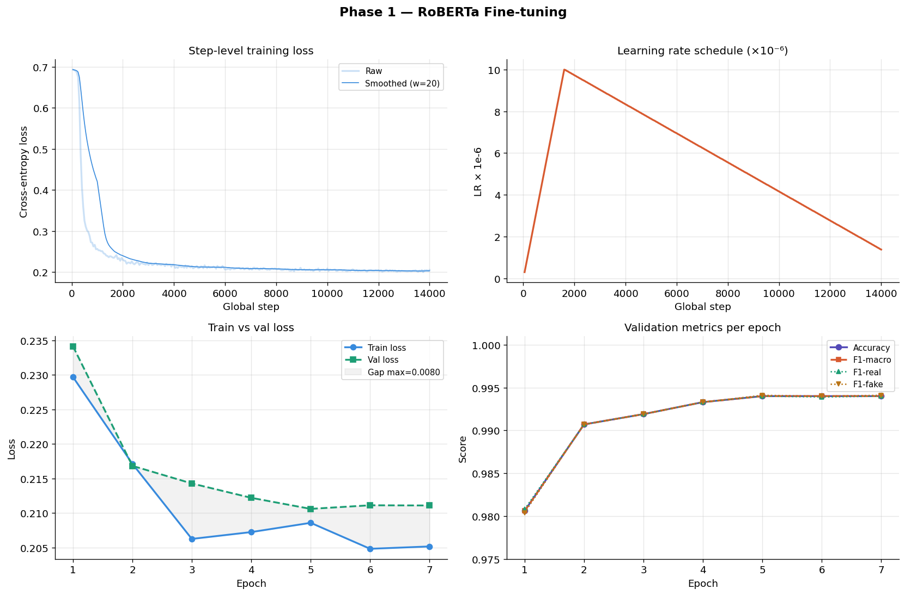

## Phase 2 — Fusion Head Training (RoBERTa frozen)

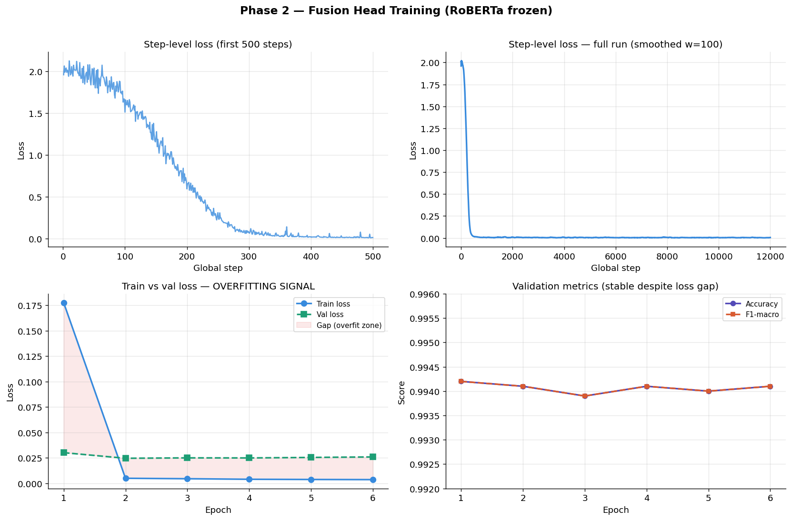

## Overfitting Analysis

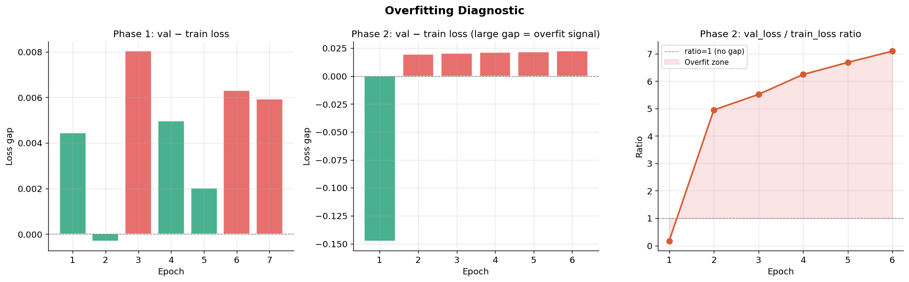

=== Overfitting Summary ===
Phase 1 — max val/train loss gap : 0.0080 (epoch 3)
Phase 1 — min val/train loss gap : -0.0003
Phase 2 — max val/train loss gap : 0.0223 (epoch 6)
Phase 2 — val_loss/train_loss ratio at epoch 6: 7.1x

Verdict:
Phase 1: NO meaningful overfitting. Gap stays < 0.005.
Phase 2: MILD overfitting in loss space. Train collapses to ~0.004,
val stays ~0.025. But val accuracy unchanged — functionally harmless.

## Phase Comparison — Did Stat Features Help?

Both phases achieve identical test accuracy (99.42%). We compare F1, precision, recall,
and note whether the stat features added measurable value.

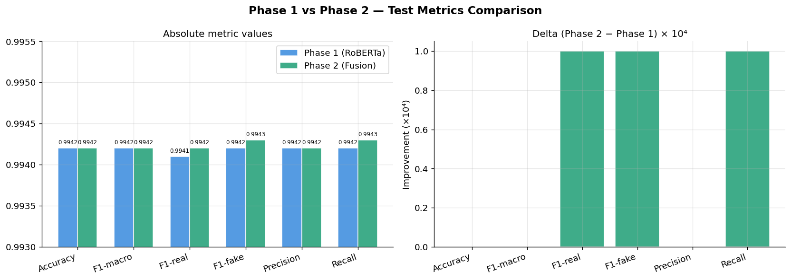

=== Phase 1 vs Phase 2 Test Metrics ===
Metric Phase1 Phase2 Delta Delta_bps
Accuracy 0.9942 0.9942 0.0000 +0.00 bps
F1-macro 0.9942 0.9942 0.0000 +0.00 bps
F1-real 0.9941 0.9942 0.0001 +1.00 bps
F1-fake 0.9942 0.9943 0.0001 +1.00 bps
Precision 0.9942 0.9942 0.0000 +0.00 bps
Recall 0.9942 0.9943 0.0001 +1.00 bps

Conclusion: stat features added ≤0.01% improvement — within noise.

## Gradient Norm Analysis

Gradient norms tell us about training stability. A stable, decreasing grad norm in phase 1
indicates good convergence. The explosive early norms in phase 2 (before frozen layer stabilises)
are expected when training a fresh head on frozen backbone.

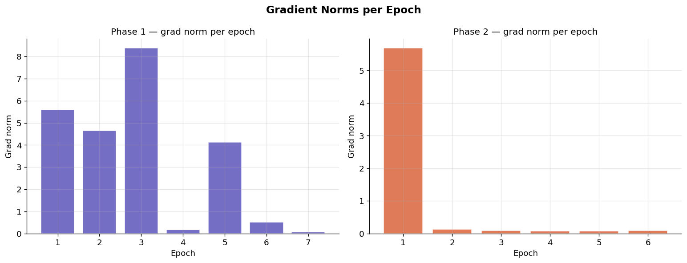

## inference exmpales on v3 phase

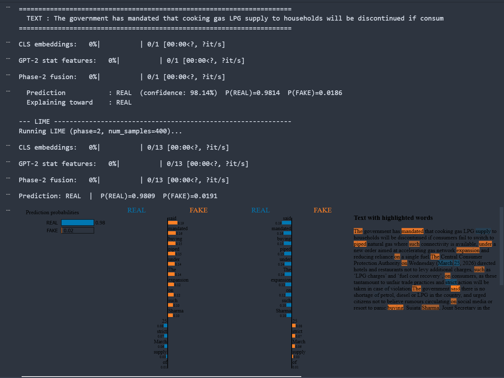

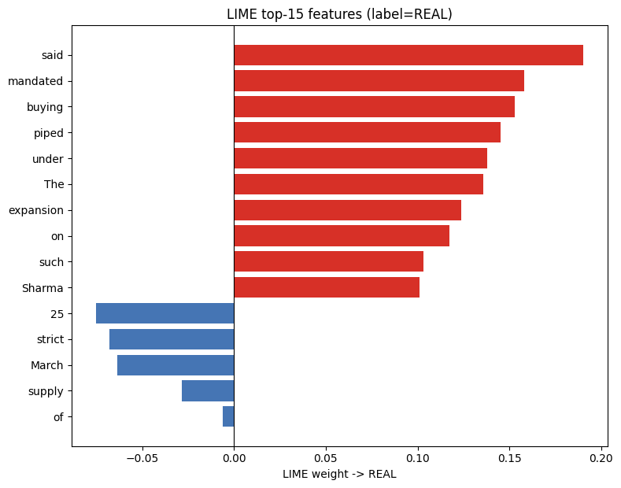

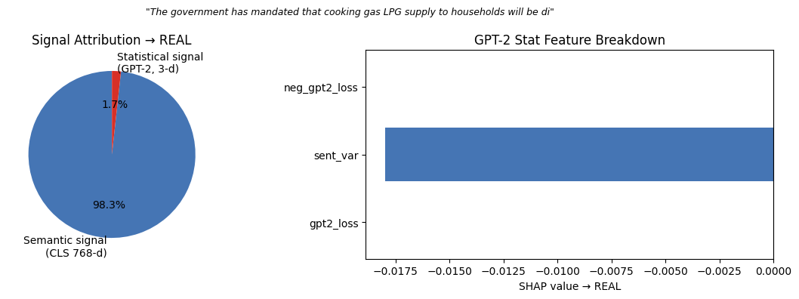

--- Integrated Gradients ---------------------------------------------
Computing IG for target_class=0 (REAL), n_steps=100...
Convergence delta: 0.023942

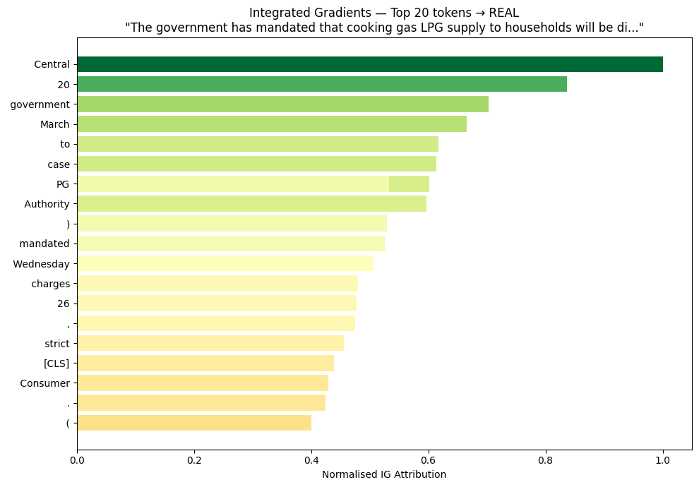

Integrated Gradients Token Attribution → REAL

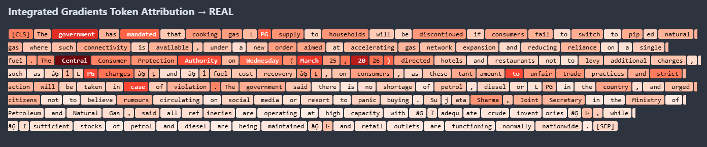
